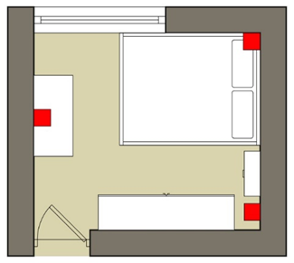
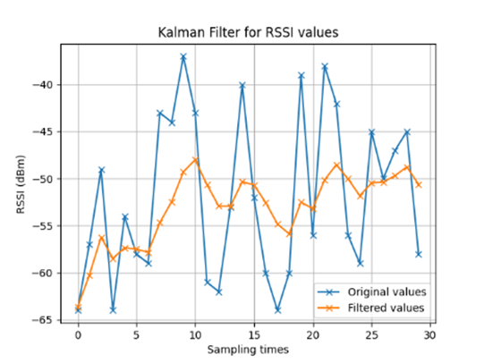
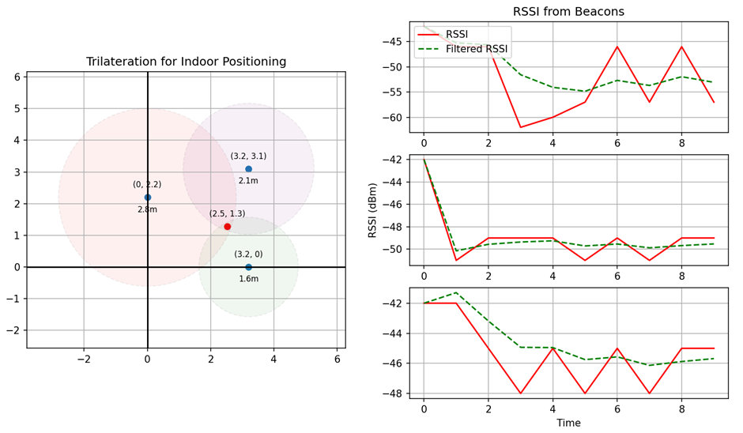
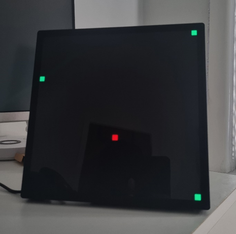
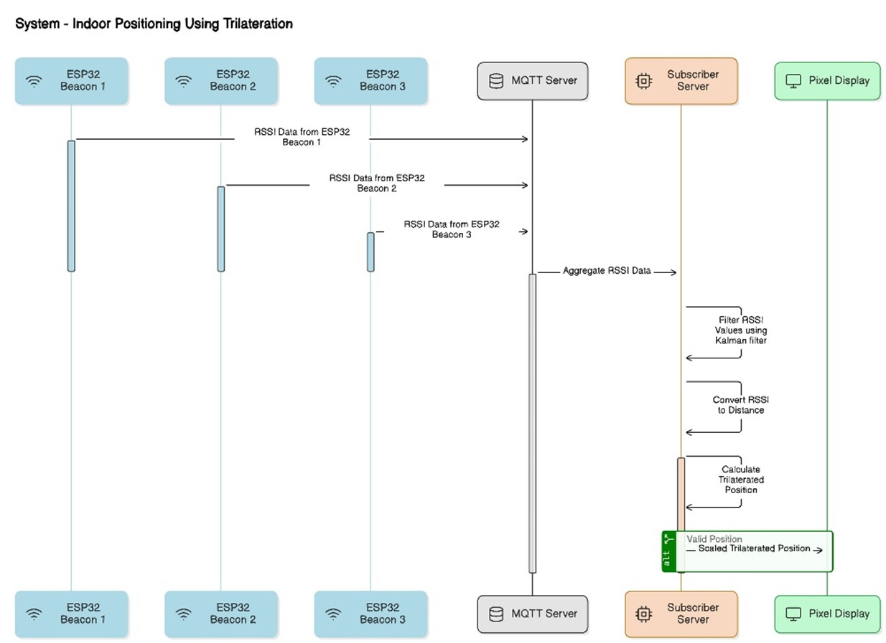

# Indoor Positioning System Using Bluetooth RSSI and Trilateration

## Overview
This project implements an indoor positioning system (IPS) using Bluetooth Low Energy (BLE) technology. It utilizes RSSI (Received Signal Strength Indicator) values from three ESP32-S3 Feather modules acting as beacons to calculate the position of a target device through trilateration. The system processes these signals to provide real-time positioning within an indoor environment.

    

Figure: Layout of the experiment area

## Features
- **Bluetooth RSSI Collection:** Collects RSSI data from multiple ESP32-S3 Feather modules using MQTT.
- **Kalman Filtering:** Applies Kalman filtering to the RSSI data to enhance accuracy.

    

Figure: Line graph showing how the Kalman filter works

- **Trilateration Algorithm:** Employs trilateration to compute the position based on RSSI values.
- **Real-time Visualization:** Uses Matplotlib to display the positioning and RSSI data dynamically.

    

Figure: Graphical display run when the server is run, showing the trilateration and RSSI values received

- **MQTT Communication:** Leverages MQTT for efficient data transmission between the beacons and the central server.

## Hardware Requirements
- 3 x ESP32-S3 Feather Boards
- 1 x PC or Laptop
- 1 x Pixel Display

    

Figure: Example of what the pixel display will look like when the server is run

- 1 x BLE-capable Device (e.g., Headphones)

## Setup and Installation
1. **Set up the MQTT Broker:** Install and configure Mosquitto on your server. You can use the Docker Compose file provided in the `/mosquitto` directory.
2. **Configure the ESP32-S3 Boards:** Flash the ESP32-S3 boards with MicroPython and set them up to transmit RSSI data via MQTT. The necessary code for this can be found in the `/beacons` directory.
3. **Run the Server:** Start the server application on your PC to receive data and perform calculations. First, create a virtual environment (venv) and install the *requirements.txt*. Then, run the Python file located at `src/server.py`.

## Usage
Start the system by powering up the ESP32-S3 boards and the target BLE device. Ensure the MQTT broker is running, and execute the server script to begin receiving and processing data. The real-time location of the target device will be displayed on the pixel display and the Matplotlib graph.

    

Figure: Sequence diagram/flow of the solution

## Future Enhancements
- Integration of additional beacons to improve coverage and accuracy.
- Exploration of alternative technologies such as Zigbee and Wi-Fi.
- Advanced filtering techniques to further refine signal processing.

## Acknowledgements
Parts of this project make use of the [python3-idotmatrix-client](https://github.com/derkalle4/python3-idotmatrix-client) library for communicating with the pixel display.